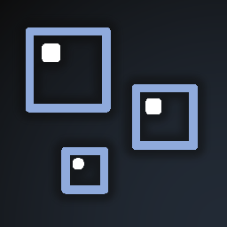

# Hi there! Thank you for checking out Blocky Bubbles!

Blocky Bubbles is a client-side [Fabric](https://fabricmc.net) mod that attempts to add the fast bubble columns feature from Bedrock Edition! It does so by making bubble columns use unbaked block models which can be modified using resource packs. This provides a decent performance improvement as well as a unique visual style you can see from the image below!

> Fast bubbles around an underwater ruined portal.

Without [Sodium](https://modrinth.com/mod/sodium), fast bubbles may be toggled through the main graphics profile; the same toggle that controls fancy leaf rendering! With Sodium, you're able to modify the setting independently, through Sodium's own video settings menu.
***

### Getting Started
Simply drag Blocky Bubbles into your mods folder. This mod doesn't require any accompanying library, but you may want to download [Sodium](https://modrinth.com/mod/sodium) to allow you to change the setting independently of your main graphics profile.
