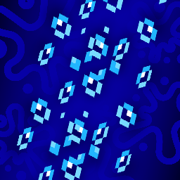

# Hi there! Thank you for checking out Blocky Bubbles!

Blocky Bubbles is a client-side [Fabric](https://fabricmc.net) mod that attempts to add the fast bubble columns feature from Bedrock Edition!

Read on to find out how to download this mod, and what opportunities doing so will provide you with!

## Getting Started
Simply head to the releases page, find the latest release for the version you're playing on, and place the jar in your mods folder. This mod doesn't require any accompanying library, but you may want to download [Sodium](https://modrinth.com/mod/sodium) to allow you to change the setting independent of your main graphics profile.

## Details
In vanilla minecraft, bubble columns emit particle effects that indicate the direction of the stream: a downward "whirlpool" for magma blocks and an updraft for soul sand. Unfortunately, rendering a lot of particle effects at once can be costly, and they don't even render behind transparent blocks like water in the fast or fancy graphics profile.

This mod allows bubble columns to use unbaked block models instead, which has the intended visual symmetry of the Bedrock Edition counterpart. This provides a decent performance improvement as well as a unique visual style you can see from the image below!

